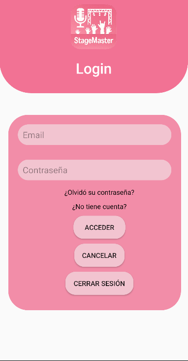
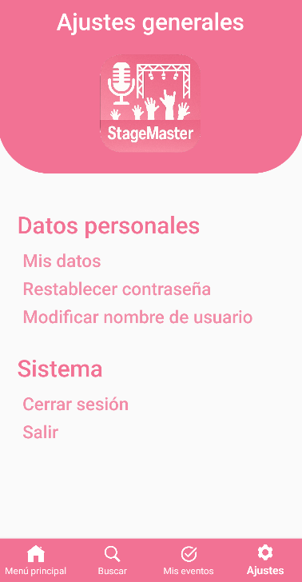

# StageMaster

## Descripción
StageMaster es un sistema de gestión de eventos para los usuarios diseñado especificamente para entornos móviles con sistema Android. Esta app, incluye
multiples funcionalidades enfocadas en cualquier ambito de sistema como en la seguridad (para autenticar a los usuarios antes de acceder a la app), o para gestionar
eventos al realizar el pago de alguno o consultar aquellos que se tiene a disposición.

## Características
- **Autenticación de usuario**: Los usuarios deberán autenticarse antes de poder acceder a la app.
- **Realización de pago**: Al interactuar con el evento, el usuario podrá realizar el pago de aquel que se seleccione.
- **Generación de codigo QR**: Una vez que el usuario realice el pago de algun evento, se le va a a generar un código QR que se puede visualizar al seleccionar dicho evento.
- **Buscar eventos**: El usuario tendrá acceso a una sección que permite buscar cualquier evento en concreto.
- **Modificar usuario**: Se tendrá permitido modificar el nombre del usuario en la sección de configuración.
- **Restablecer contraseña**: Se tendrá permitido restablecer la contraseña del usuario en la sección de configuración y antes de autenticarse.

## Tecnologías utilizadas
- **Lenguajes**: Java, Kotlin, XML y SQL.
- **Base de datos**: SQLite.
- **Paquetes adicionales**: Bitmap, ButtomNavigator.

## Aplicación
A continuación se va a poder visualizar algunas de las ventanas que más caracterizan a StageMaster.
- **Login de usuario**.

- **Menú principal**.
  

- **Ajustes**
  

## Instalación

## Contacto
- **Nombre**: David Castro Pérez
- **Correo electrónico**: davidcastroperez93@gmail.com
- **Linkedin**: linkedin.com/in/davidcastropérez-bbb025307
- **GitHub**: github.com/davidcasstroo11
